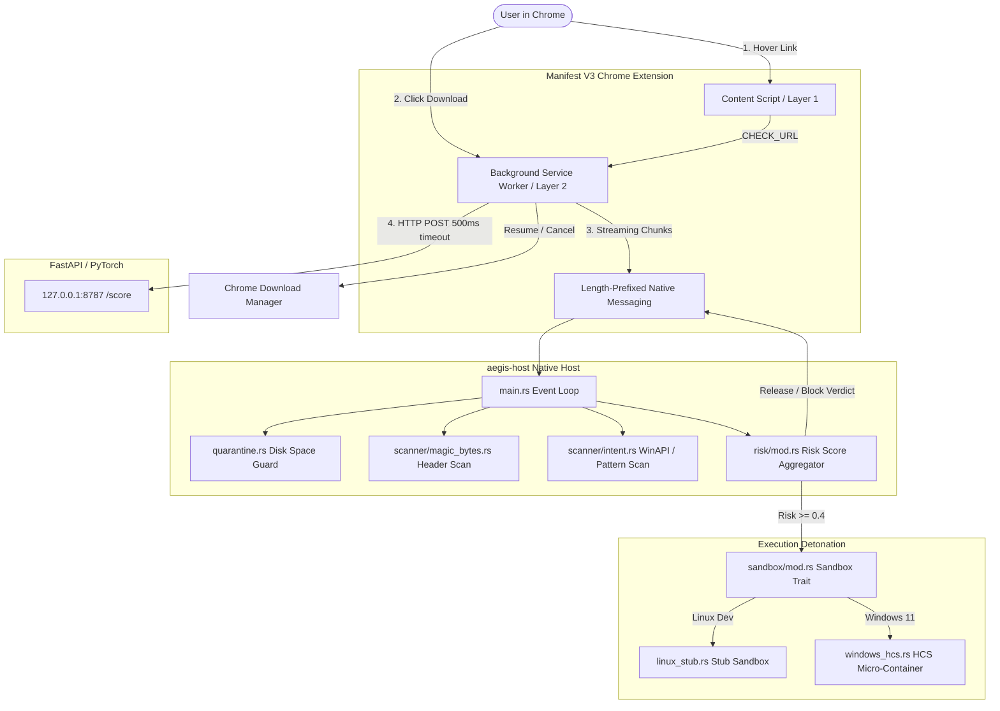

# Aegis — System Architecture

Aegis is a two-layer, real-time endpoint download-safety system designed for high-assurance protection against malicious web links and weaponized file downloads.

---

## 1. High-Level Component Diagram

---

## 2. Component Breakdown

### 2.1 Chrome Extension (`extension/`)
- **Manifest V3** compliant.
- **Layer 1 (Hover Triage):** `content_script.js` listens to link hover (`mouseover`), debounces by 150ms, checks session cache (10m TTL), or sends `CHECK_URL` to `background.js`. Injects color-coded risk badge near cursor.
- **Layer 2 (Download Interception):** `background.js` catches `chrome.downloads.onCreated`, pauses the download in Chrome, connects via native messaging (`com.aegis.sandbox`), and streams the file in **256 KB fixed-size chunks** via `fetch()` and `ReadableStream` with backpressure (`CHUNK_ACK`).

### 2.2 Native Messaging Host (`aegis-host/`)
- Written in **Rust 2021**.
- **Memory/Disk Safety:** Bounded memory ring buffer (4 chunks = 1MB sliding context window) for cross-chunk pattern matching. Free disk space verified against 2× headroom before accepting downloads.
- **IPC Protocol:** Standard 4-byte little-endian length prefix with hard 1MB ceiling per message.
- **Scanners:**
  - `magic_bytes.rs`: Scans chunk 0 for magic bytes (PE, ELF, ZIP, PDF, PNG, etc.) vs claimed file extension. Executable masquerading as document/image scores 0.8 risk.
  - `intent.rs`: Scans all chunks for 30+ WinAPI and shell injection indicators (`CreateRemoteThread`, `SetWindowsHookEx`, `certutil`, `powershell`, reverse shells).
- **Quarantine:** Files stored in `std::env::temp_dir()/aegis_quarantine/` with `{uuid}_{sanitized_filename}` names. Restricted permissions (`0700` Unix / ACL Windows). Deleted automatically on verdict.

### 2.3 Sandboxing Layer (`aegis-host/src/sandbox/`)
- Trait-based architecture (`Sandbox` trait).
- `linux_stub.rs`: Dev-mode stub on Linux that returns `Verdict::Suspicious` (fail cautious).
- `windows_hcs.rs`: Windows 11 Host Compute Service (HCS) micro-container detonation:
  - Ephemeral VHDX diff disk per session (discarded immediately).
  - Isolated network namespace (no NIC attached by default).
  - 30-second detonation timeout.

---

## 3. How Aegis Differs from MDAG, Windows Sandbox, and Bromium

| Feature | Aegis | MDAG (Microsoft Defender Application Guard) | Windows Sandbox | Bromium (HP Wolf Security) |
|---|---|---|---|---|
| **Trigger Point** | Hover link (Layer 1) & File Download (Layer 2) | Whole browser tab isolation | Manual desktop session launch | Micro-VM per document open |
| **Interception Method** | Chrome Native Messaging + Stream Chunks | Enterprise browser policy redirect | User manual launcher | Kernel-level driver hooks |
| **Micro-Container Overhead** | Ephemeral guest per download (seconds) | Persistent Heavy VM per browser session | Full Windows desktop VM boot | Micro-hypervisor (ARM/Intel VT-x) |
| **Streaming Static Scan** | Yes (Magic bytes + heuristic pattern ring buffer) | No (Tab isolation only) | No | No |
| **Platform Portability** | Cross-platform host (Linux stub / Windows HCS) | Windows Enterprise Only | Windows Pro/Ent Only | Windows Enterprise Only |

---

## 4. Large File Handling Strategy & Tradeoffs

For files exceeding `max_detonation_size` (default **250 MB**):
1. Streaming static forensic scan runs normally over all chunks.
2. If static checks trigger the sandbox threshold, live HCS detonation is **skipped** to prevent boot times / VHD allocation stalls on multi-GB ISOs.
3. The system returns a clear `WARNING_TOO_LARGE_TO_SANDBOX` verdict to the user with the static risk score and details, allowing informed user release while maintaining host stability.
