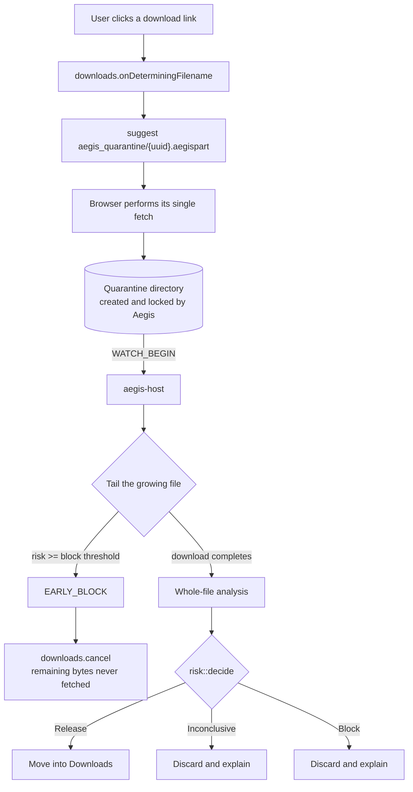

# Aegis — Architecture

How the system actually works, as built. Where a design decision has a
non-obvious reason, the reason is here; the full audit trail is in
[DECISIONS.md](../DECISIONS.md).

---

## 1. The core idea

A browser download normally goes straight to the user's Downloads folder. Aegis
inserts itself into the naming step, redirects the file into a directory it
controls, and watches the bytes arrive. Only a file that passes analysis is
moved to where the user expects it.



Two properties follow from this shape, and they are the whole point:

**The file is never in Downloads unless it passed.** Not briefly, not pending a
result. The browser writes to a path inside the quarantine directory, so there
is no window during which a malicious file sits at the expected location under
the expected name.

**Detection can cancel a transfer in progress.** Analysis runs on bytes as they
arrive rather than on a finished file, so a signature found in the first few
kilobytes of a 50 MB download stops the remaining bytes from being fetched at
all.

---

## 2. Why the browser does the fetching

The most important design constraint, and the one the previous architecture got
wrong.

Chrome exposes **no API for a download's byte stream**. An extension that wants
the bytes has exactly one option: fetch the URL a second time. The original
design did that, and it produced four separate problems:

- **The bytes scanned were not the bytes delivered.** A server can serve benign
  content to the scanner and malicious content to the browser. That is a
  time-of-check/time-of-use hole no amount of scanning quality can fix.
- **Bandwidth doubled.**
- **Many downloads broke outright.** POST-initiated downloads, one-time tokens,
  `blob:` URLs and anything behind session auth cannot be re-fetched.
- **`pause()` does not prevent writing.** The file landed in Downloads anyway,
  and `resume()` completed it in place.

Letting the browser perform the single fetch it was always going to perform
solves all four at once. Cookies, sessions, POST bodies and one-time tokens keep
working because it is the browser's own request.

> **Do not reintroduce extension-side fetching.** It looks simpler and it
> reintroduces a TOCTOU vulnerability.

### Why quarantine lives under Downloads

`onDeterminingFilename` only accepts paths **relative to the default download
directory**. Absolute paths and `..` are rejected by the browser. So the
quarantine directory has to be `<Downloads>/aegis_quarantine/`.

That is a browser constraint, not a preference, and it is compensated for by
locking the directory down (§5).

---

## 3. Components

```
extension/                    Chromium MV3 extension
  background.js               onDeterminingFilename redirect, session
                              persistence across service-worker restarts,
                              health probe, notifications, fail-closed paths
  popup/                      live scans, verdict history, structured findings
  native-messaging/           the manifest that registers the host

aegis-host/src/               Rust native messaging host
  main.rs                     message loop, session handling, trust-boundary
                              path validation
  watcher.rs                  tails the growing download, early-kill logic
  release.rs                  THE ONLY PATH INTO DOWNLOADS
  quarantine.rs               directory hardening, filename sanitisation
  risk/mod.rs                 thresholds -> decision
  config.rs                   aegis.toml; fails fast, never silently defaults
  ipc/native_messaging.rs     4-byte LE framing, 1 MB bound
  scanner/
    mod.rs                    orchestration and score combination
    finding.rs                the explanation layer
    magic_bytes.rs            declared type vs actual
    intent.rs                 red-flag strings, UTF-8 and UTF-16LE
    structure.rs              polyglots, trailing data, double extensions
    entropy.rs                packing and encryption
    pe.rs                     PE sections, packers, entry point, imports
    archive.rs                ZIP central directory walk
    autoexec.rs               formats that run something when opened
    signature.rs              Authenticode
```

### Protocol

```
Extension -> Host   PING
Host -> Extension   PONG        {version, exe, quarantine_subdir}

Extension -> Host   WATCH_BEGIN {session_id, quarantine_path, original_filename}
Host -> Extension   PROGRESS    {session_id, bytes, score}        advisory
Host -> Extension   EARLY_BLOCK {session_id, risk_score, reason}
Host -> Extension   VERDICT     {session_id, status, verdict, findings,
                                 released_path?}

Extension -> Host   CHECK_URL   {url}
Host -> Extension   URL_SCORE   {score, label}
```

`PING`/`PONG` exists so a broken installation shows up in the popup as "Aegis
cannot reach its scanner" rather than silently becoming "every download is
blocked" the next time the user downloads something.

---

## 4. The two scanning passes

The checks divide naturally by what they need.

### Streaming pass — `deep_forensic_scan`

Runs on each new span of bytes while the download is still arriving. Only checks
that work on a *prefix* can live here:

- **magic bytes** (first span only) — does the content match the extension?
- **intent strings** (every span) — malware-associated API names

This is what makes the early kill possible. A 512-byte trailing window is
carried between spans so a pattern split across a read boundary still matches.
Memory is flat regardless of file size: one chunk plus the window.

**Intent scanning reads three views of the same bytes** — lossy UTF-8, and
UTF-16LE at *both* byte alignments. Windows PE files store API names as
UTF-16LE, where `CreateRemoteThread` is `43 00 72 00 65 00 …`. Scanning only
UTF-8 decoded that to `C<FFFD>r<FFFD>e…` and matched nothing, so the scanner was
blind to most of what its own red-flag table targets.

Non-text byte pairs decode to NUL rather than being skipped. Skipping would
splice unrelated fragments together and manufacture matches that are not in the
file — `Create` + binary gap + `RemoteThread` must not become
`CreateRemoteThread`.

### Whole-file pass — `whole_file_scan_at`

Runs once the download completes. These checks cannot work on a prefix: you
cannot find the bytes *after* a PNG's `IEND` chunk until you have all of them,
and a ZIP's index lives at the end of the file.

- **structure** — polyglots, appended payloads, double extensions
- **entropy** — packing, interpreted relative to the declared type
- **PE** — sections, packers, entry point, import table
- **archive** — the ZIP central directory
- **auto-execution** — macros, shortcuts, autorun
- **Authenticode** — signature and publisher

Bounded by `max_whole_file_scan_bytes` (default 64 MB). Larger files keep their
streaming scan and the verdict states which checks were skipped, rather than
implying a clean result.

### How the scores combine

**Within the whole-file pass: maximum, not sum.** These analyses overlap. A
packed executable trips entropy *and* PE section checks for the same underlying
fact; summing would double-count it and push ordinary packed software past the
block threshold.

**Across the two passes: sum.** "The extension lies about the type" and "a ZIP
is appended after the image data" are genuinely independent facts.

**One signal can subtract.** A valid Authenticode signature is the only input
that lowers a score, under the strict rule in §7.

### Two checks worth explaining

**Import tables beat string matching.** Searching a file for the text
`CreateRemoteThread` proves nothing — the string could be anywhere, including
compressed data or a help message. Finding it in the **import table** means the
Windows loader has been instructed to resolve that function before the program
starts. It cannot be there by accident. The converse is also a signal: a program
importing almost nothing is resolving everything at runtime, which is what
packed code does.

**Archives are read, not unpacked.** A ZIP records every entry twice, and the
central directory at the end is the authoritative index. Parsing it yields every
name, size and flag without decompressing anything — which matters because a
zip bomb cannot be triggered by a scanner that never inflates, and the ratio
that identifies one is right there in the header.

---

## 5. Trust boundaries

### `quarantine_path` — extension to host

`WATCH_BEGIN` carries a path chosen by the extension. That path crosses into a
process which will read the file and, on a clean verdict, **move it into the
user's Downloads folder**.

Unvalidated, that is an arbitrary file read and an arbitrary file move: a
compromised extension could name `C:\Windows\System32\config\SAM` and have Aegis
helpfully relocate it.

`validate_quarantine_path` canonicalises both the claimed parent and the
quarantine root *before* comparing, so `..`, symlinks, junctions and 8.3 short
names cannot escape. It additionally requires the filename stem to be a UUID
Aegis could have issued.

It deliberately does **not** check the extension. Aegis suggests
`{uuid}.aegispart`, but Chromium re-applies its own extension from the response
MIME type, so a PDF lands as `{uuid}.pdf`. Requiring `.aegispart` made the host
reject every real download — it was refusing its own quarantine files, and the
log said so in a way nobody read for hours.

### The quarantine directory

It sits inside the user's Downloads folder (§2), so it would otherwise inherit
that folder's permissions. `Quarantine::secure` creates it and locks it down:
`0700` on Unix; on Windows, inheritance stripped and full control granted to
exactly one principal via `icacls`.

**Fail closed:** if the directory cannot be secured, the host aborts at start-up.
Scanning samples an attacker might be able to swap underneath you is worse than
not running at all.

It is re-secured per session, because anything can delete the directory between
sessions and a recreated one would inherit Downloads' permissions again.

### Filenames

`sanitize_filename` removes what is dangerous and keeps what is not: path
separators, `..`, control characters, the characters Windows forbids, trailing
dots and spaces, reserved device names, and bidirectional overrides.

That last one matters. `invoice<U+202E>fdp.exe` *displays* as `invoiceexe.pdf`.
The archive scanner reports that as Critical inside a ZIP; without stripping it
here, the identical trick would survive into a released filename, where nothing
looks for it.

It does not use an ASCII allowlist. Safety needs specific characters gone, not a
narrow character set — and the allowlist version turned `Résumé.pdf` into
`R_sum_.pdf` and any filename not written in English into a row of underscores.

---

## 6. Failure policy

**Layer 2 (files) fails closed. Layer 1 (URL badges) fails open.**

The asymmetry is deliberate. A hover badge is advisory, and browsing must not
break because a scorer is unavailable. A file verdict is a gate, and an
unverifiable file must not be delivered.

Every extension failure path calls `chrome.downloads.cancel()` — host
unreachable, port disconnected mid-scan, unexpected error. None of them resume.

**When Aegis fails, the interface must say so.** `isInfrastructureFailure` in
`background.js` distinguishes "this file is dangerous" from "Aegis could not
run", and the popup shows an amber *misconfigured* state rather than a red
*threat* one. Blocking a file **and** implying it was malicious when you simply
could not scan it is its own kind of harm.

### Interaction with Defender

Writing a known sample into quarantine can produce `os error 225`
(`ERROR_VIRUS_INFECTED`): Defender's real-time protection removed the file
first. That is correct behaviour by Defender, and Aegis maps it to a normal
block naming the other product rather than treating it as a crash.

**A Defender exclusion for the quarantine directory was explicitly rejected.**
It would disable real-time protection on the one folder guaranteed to contain
live malware, trading a real layer of defence for attribution of the block.
Losing that race is the correct outcome.

A consequence for testing: **do not use EICAR in on-disk tests.** You will
measure Defender, not Aegis.

---

## 7. Authenticode, and why the credit is small

A signature is the strongest legitimacy signal available without running
anything, and the only check that can produce *good* news. It is also the
easiest to get wrong.

The treatment is asymmetric on purpose:

- **A broken signature is strong evidence against.** `TRUST_E_BAD_DIGEST` means
  the bytes changed after signing. There is no innocent explanation.
- **A valid signature is weak evidence in favour.** Code-signing certificates
  are stolen and abused routinely, and cheap ones are bought with fabricated
  company details.

So the credit a valid signature earns is **capped** (`MAX_TRUST_CREDIT = 0.25`)
and **withheld entirely** when any Critical or High finding is present.

That second rule is load-bearing. Without it, signing your malware would buy
down a real detection: a packed dropper with a stolen certificate would score
*lower* than the same dropper unsigned, inverting the whole point. A signature
can settle an ambiguous file; it can never argue away a strong one.

Verification runs with `WTD_REVOKE_NONE` and `WTD_CACHE_ONLY_URL_RETRIEVAL` — no
network. Revocation checking fetches CRLs and OCSP responses, which in a
download scanner means an unbounded stall mid-download and a scanner that
behaves differently depending on connectivity. The cost is real and worth
stating plainly: **a revoked certificate still verifies here**, which is a third
reason the credit is small.

Catalog signing is checked too. Most Windows system binaries carry no embedded
signature at all, so an embedded-only check would report `notepad.exe` as
unsigned.

---

## 8. Decisions

```
score >= block_threshold   (0.85)   -> Block          confirmed detection
score >= sandbox_threshold (0.40)   -> Inconclusive   signals found, not conclusive
otherwise                           -> Release        delivered
```

Only `Release` delivers the file. `Inconclusive` and `Block` both hold it — the
difference is what the user is told, and that difference is real. Aegis does not
execute downloads, so in the middle band there is no further evidence to gather;
the file is held and the message says it could not be cleared, not that it is
malware.

There is no detonation stage. See [README](../README.md#why-there-is-no-sandbox)
and DECISIONS.md for why it was removed rather than finished — briefly: a
user-mode sandbox shares the kernel, produces weak evidence against
sandbox-aware malware, requires running unknown malware on the user's own
machine, and would replace a safe fail-closed default with a mechanism that can
return "clean".

---

## 9. Dependencies as attack surface

The host parses hostile input and can move files into Downloads, so its
dependency tree is part of the threat model rather than an implementation
detail. It is deliberately small — 92 crates, `cargo audit` clean.

The HTTP client was removed along with the URL-scoring call it existed for. It
was more than half the tree, brought a TLS stack with no other use, and carried
the only advisory `cargo audit` reported. **The host now has no outbound network
capability at all**, which is a better thing to have on a machine than one that
merely does not use its network stack.

---

## 10. Testing

351 tests. The ones that matter most are not the ones that check detection.

**Several tests assert that ordinary files are RELEASED.** Every check added to
Aegis is a fresh chance to start blocking legitimate downloads, and a scanner
that blocks everything is indistinguishable from a broken one. `archive.rs`
carries the same guard internally: an ordinary installer archive must stay below
the threshold, because archives containing programs are completely normal.

**`tests/real_containers.rs` uses containers written by real Windows tools** —
`Compress-Archive`, Explorer shortcuts — not by our own encoder. A parser
validated only against its author's fixtures is validated against nothing, and
this project's characteristic bug is code that was right about a format the real
world writes differently.

**`tests/fuzz_parsers.rs` runs 41,200 mutation cases per invocation.** Seeded and
deterministic, so any failure replays exactly from the seed in the assertion.
Mutations are weighted toward slamming aligned 2/4/8-byte windows with `0xFFFF`
and `0xFFFFFFFF`, because that is the bug class these parsers face: every offset,
length and count they act on is a number the attacker wrote.

The oracle is no panic **and** a per-input time budget. Hangs matter as much as
crashes: each parser bounds its loops, and a wrong bound means a crafted file
spins while the download sits open forever.

A panic here is not an ordinary crash. The host dying drops the native messaging
port; the extension reads that as "cannot verify" and cancels. One crafted file
would jam downloads machine-wide — safe, but broken.

---

## 11. Known limitations

- **No signature database.** Known malware is Defender's job, and it is better
  at it.
- **Nothing is executed**, so malware that only reveals itself by running is
  invisible here.
- **Encrypted archives cannot be inspected.** Reported as unscannable rather
  than cleared — nothing can read inside them, including your antivirus, which
  is exactly why malware campaigns ship them.
- **Revoked certificates still verify** (§7).
- **Files over 64 MB skip whole-file analysis**, and the verdict says so.
- **Authenticode is Windows-only.** Other platforms lose that check entirely.
- **The extension is MV3 Chromium-specific.** Firefox has a different downloads
  API and is not supported.
- **A clean verdict means "no evidence found"**, not "this file is safe".

---

## 12. Working on this

```bash
cd aegis-host
cargo test
cargo clippy --all-targets -- -D warnings
cargo build      # makes changes live: the manifest points at target/debug
```

Then reload the extension and download something. The log is
`aegis-host/target/debug/aegis-host.log`.

**Run it, don't just read it.** Every real bug in this project has been
invisible to code review: log output corrupting the protocol stream, a filename
the browser silently rewrote, a registry hive belonging to a browser that was
not installed. When you fix a silent failure, add a test that would have caught
it.
